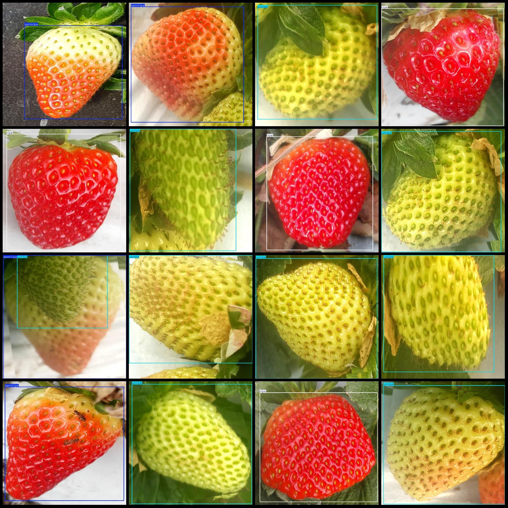
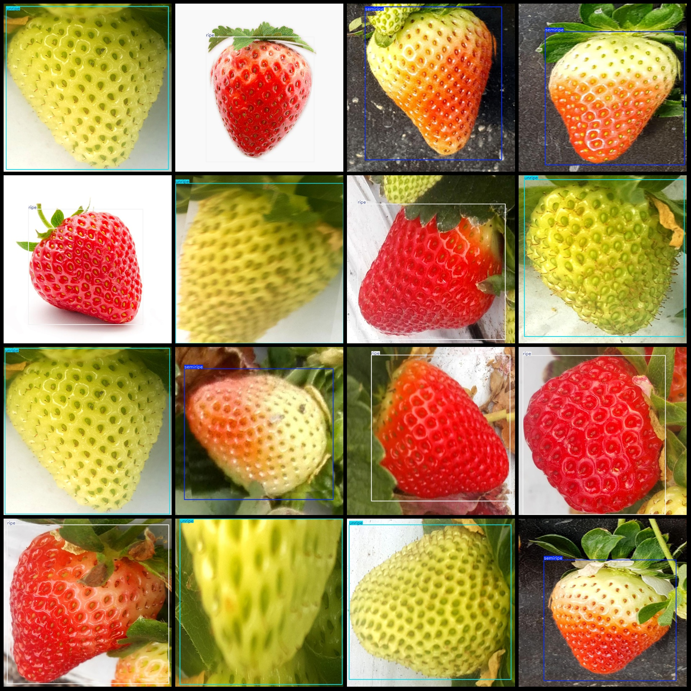

# Sweet-Potato Maturity Detection Dataset VOC+YOLO Format, 1487 Images in 3 Categories with Enhancements

Please note that about one-third of the dataset is original images, and the rest are enhanced images. For more details, please refer to the image.
Dataset format: Pascal VOC format+YOLO format(without split path's txt file, only contain jpg picture and corresponding VOC formatxml file and yolo formattxt file)
Number of pictures (JPG files): 1487
1487
Quantity of txt files: 1487
annotationnumber of classes: 3  
Annotation class names: ["ripe", "semiripe", "unripe"]
boxes per class:   
ripe box count = 793  
semiripe box count = 272
unripe box count = 588  
total boxes: 1653  
images per class:   
ripe images = 697  
semiripe images = 271  
unripe images = 553  
image resolution: 800x800  
Use labelImg as a annotation tool.
Annotation Rule: Draw a rectangle around the category.
Important Notice: The dataset is not split into training, validation, and test sets. Please manually split it.
Special notice: This dataset does not guarantee the accuracy of the trained model or weight files.
Preview of the image:  
Annotation examples:
## Images

Here is a pay link on Stripe ( https://buy.stripe.com/3cs8yP7sY87d0vu9AB ). Please contact me lonlonago@foxmail.com after funding $89, and I will send you a complete data files , thank you!

